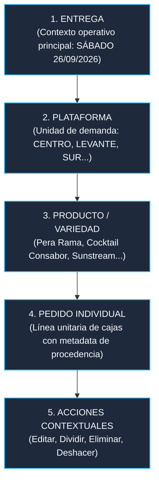
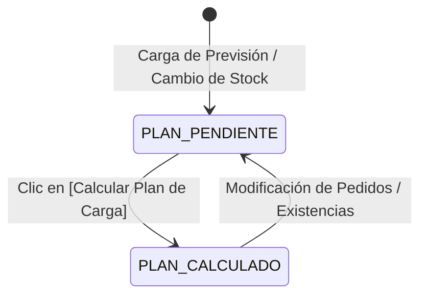

# ESPECIFICACIÓN FINAL DE DISEÑO Y ARQUITECTURA UX DESKTOP (V4)
## VERSIÓN DEFINITIVA — DESIGN FREEZE
**Proyecto:** PlanificadorCarga-V4  
**Ámbito:** Shell Desktop (≥1024px)  
**Compatibilidad:** Preparado para el Centro de Control Operativo (CCO)  
**Filosofía:** Precisión, Control, Claridad y Trazabilidad Operativa (Inspiración SaaS B2B: Linear / Stripe / Mercury)  
**Estado:** DESIGN FREEZE — Aprobado conceptualmente. Pendiente de implementación.  
**Motores y Lógica:** 100% Congelados e Intactos.  
**Mobile:** 100% Congelado e Intacto (`src/mobile.css` inalterado).  

---

## ÍNDICE
1. [Principios Rectores y Arquitectura de Información](#1-principios-rectores-y-arquitectura-de-información)
2. [Header Operativo de Producción (Limpio, sin RC)](#2-header-operativo-de-producción-limpio-sin-rc)
3. [Modelo de Contexto de Entrega (Dinámico y Escalable)](#3-modelo-de-contexto-de-entrega-dinámico-y-escalable)
4. [Definición Formal de Estados: PLAN PENDIENTE vs PLAN CALCULADO](#4-definición-formal-de-estados-plan-pendiente-vs-plan-calculado)
5. [Regla Visual de Divisiones: DEMANDA vs PLAN](#5-regla-visual-de-divisiones-demanda-vs-plan)
6. [Separación Estricta: STOCK vs ACCIÓN GLOBAL DE CÁLCULO](#6-separación-estricta-stock-vs-acción-global-de-cálculo)
7. [Progressive Disclosure y Eliminación de Scroll Innecesario](#7-progressive-disclosure-y-eliminación-de-scroll-innecesario)
8. [Wireframe Desktop Completo Actualizado](#8-wireframe-desktop-completo-actualizado)
9. [Catálogo de Wireframes por Componente y Estado](#9-catálogo-de-wireframes-por-componente-y-estado)
10. [Design System Unificado (SaaS B2B)](#10-design-system-unificado-saas-b2b)
11. [Elementos Eliminados y Reubicados](#11-elementos-eliminados-y-reubicados)
12. [Archivos a Modificar y Elementos Intactos](#12-archivos-a-modificar-y-elementos-intactos)
13. [Protocolo Estricto de Verificación y Tests](#13-protocolo-estricto-de-verificación-y-tests)
14. [Plan de Implementación Paso a Paso (Fase 1C)](#14-plan-de-implementación-paso-a-paso-fase-1c)

---

## 1. PRINCIPIOS RECTORES Y ARQUITECTURA DE INFORMACIÓN

La aplicación responde a una única jerarquía operativa:



### Reglas Clave:
1. **La Fecha de Entrega es el Contexto Soberano:** No existen secciones separadas de "Anticipados", "Previsiones" o "Manuales". Esos términos son **metadatos**. Todo pedido pertenece a la fecha de entrega en que deba cargarse.
2. **Separación Radical de Dimensiones:**
   - **DEMANDA** (*¿Qué han pedido?*): Cajas requeridas, clientes/destinos, catálogo de producto, líneas activas.
   - **PLAN DE CARGA** (*¿Cómo lo servimos físicamente?*): Palets terminados, torres completas o remontadas, formatos (EURO / METROCHEP), huecos de suelo de camión y hojas de expedición.
3. **Ergonomía de Muelle (Regla de los 3 Segundos):** El operario debe conocer la fecha, los destinos, las cajas solicitadas, las servidas y los pendientes sin realizar ningún clic ni scroll previo.

---

## 2. HEADER OPERATIVO DE PRODUCCIÓN (LIMPIO, SIN RC)

Se retira cualquier indicador de versión técnica de desarrollo (`RC3.1`) de la cabecera visible de escritorio. La cabecera transmite sobriedad y pertenencia al ecosistema CCO:

```
┌──────────────────────────────────────────────────────────────────────────────────────────────────┐
│  ● PLANIFICADOR DE CARGA   │   ENTREGA: SÁBADO 26/09/2026                 [ ☀️ / 🌙 ]   [ IDLE ]  │
└──────────────────────────────────────────────────────────────────────────────────────────────────┘
```

* **Izquierda:** Indicador de estado en vivo (punto esmeralda), título formal en mayúsculas sobrias `PLANIFICADOR DE CARGA` y separador tipográfico con la fecha de entrega activa.
* **Derecha:** Selector de tema (Dark / Light) con listener directo y badge de sincronización del plan (`IDLE` / `CALCULADO`).

---

## 3. MODELO DE CONTEXTO DE ENTREGA (DINÁMICO Y ESCALABLE)

El selector no asume un número fijo de pestañas (tabs). Es un **selector de contexto dinámico** que se alimenta automáticamente de las fechas registradas en los pedidos activos (`state.getAvailableDeliveryDates()`):

```
┌──────────────────────────────────────────────────────────────────────────────────────────────────┐
│  CONTEXTO DE ENTREGA:                                                                            │
│  ┌─────────────────────────────────┐ ┌────────────────────────┐ ┌─────────────────────────────┐   │
│  │ SÁB 26/09/2026 · 537 cjs (19) ✓ │ │ DOM 27/09/2026 · 140 (4)│ │ + Añadir Entrega / Pedido   │   │
│  └─────────────────────────────────┘ └────────────────────────┘ └─────────────────────────────┘   │
│  ℹ️ Estás planificando la entrega del SÁBADO. La demanda del DOMINGO se gestiona en su contexto.  │
└──────────────────────────────────────────────────────────────────────────────────────────────────┘
```

* Soporta 1, 2, 3 o N fechas detectadas con scroll horizontal suave si exceden el ancho.
* Al conmutar de fecha:
  - Cambia instantáneamente la Demanda visible.
  - Cambian las plataformas y productos.
  - Cambia el balance global.
  - Cambia el plan físico generado para ese día.
* Nunca se mezclan pedidos de fechas diferentes.

---

## 4. DEFINICIÓN FORMAL DE ESTADOS: PLAN PENDIENTE vs PLAN CALCULADO

Se eliminan por completo los datos ficticios o inventados antes de calcular. Se definen formalmente dos estados puros:



### Estado A: PLAN PENDIENTE (Antes del cálculo o tras modificar datos)
- **Tarjeta de Plataforma en Demanda:**
  - `DEMANDA`: Cifra real (ej. `130`)
  - `SERVIDO`: `—`
  - `PENDIENTE`: `—`
  - `ESTADO`: Etiqueta neutra de texto `Plan pendiente de generar`
- **Balance Global:** Muestra total demandado y avisa: `Pendiente de calcular plan de carga`.
- **Sección Plan de Carga:** Barra compacta de aviso contextual (sin cajas vacías gigantes):  
  `📋 PLAN PENDIENTE · Introduce existencias de stock y pulsa [Calcular Plan de Carga]`.

### Estado B: PLAN CALCULADO (Cálculo logístico completado)
- **Tarjeta de Plataforma en Demanda:**
  - `DEMANDA`: Cifra real (ej. `130`)
  - `SERVIDO`: Cifra real calculada por el solver (ej. `110`)
  - `PENDIENTE`: Cifra real restante (ej. `20`)
  - `ESTADO`: Porcentaje con código de color funcional (`84.6% servido` en ámbar si falta stock, `100.0% servido` en verde si está completo, `0%` en rojo).
- **Balance Global:** Totales globales exactos calculados por `PlanningResult`.
- **Sección Plan de Carga:** Cuadrícula de tarjetas de camión con asignación física de palets, torres y huecos.

---

## 5. REGLA VISUAL DE DIVISIONES: DEMANDA vs PLAN

La relación entre pedidos divididos se modela con total nitidez:

```
VISTA DE DEMANDA (CLIENTE)                         VISTA DE PLAN DE CARGA (MUELLE)
┌─────────────────────────────────────────┐       ┌──────────────────────┐  ┌──────────────────────┐
│ CENTRO                        130 cajas │       │ CENTRO 1             │  │ CENTRO 2             │
│ PERA RAMA                      55 cajas │  ───> │ Subpedido de CENTRO  │  │ Subpedido de CENTRO  │
│   ↳ CENTRO 1 · 30 cjs                   │       │ 30 cajas · 1 palet   │  │ 25 cajas · 1 palet   │
│   ↳ CENTRO 2 · 25 cjs                   │       │ Hueco de camión 1    │  │ Hueco de camión 2    │
└─────────────────────────────────────────┘       └──────────────────────┘  └──────────────────────┘
```

1. **En DEMANDA:**
   - La plataforma matriz `CENTRO` agrupa la totalidad de la demanda (130 cajas).
   - Al abrir el detalle, se visualizan los dos subpedidos independientes: `CENTRO 1 (30 cjs)` y `CENTRO 2 (25 cjs)`.
   - El pedido padre de 55 cajas queda marcado como registro histórico inactivo sin sumar doblemente.
2. **En PLAN DE CARGA:**
   - `CENTRO 1` y `CENTRO 2` son **unidades operativas independientes de transporte**.
   - Cada tarjeta de camión muestra en grande su nombre operativo (`CENTRO 1`) y un subtítulo secundario de filiación:  
     `↳ Subpedido de CENTRO`.
   - Esto garantiza que en el muelle se sabe a qué cliente/destino matriz corresponde cada hueco de camión.

---

## 6. SEPARACIÓN ESTRICTA: STOCK vs ACCIÓN GLOBAL DE CÁLCULO

Para evitar confusiones operativas, la entrada de inventario y la ejecución algorítmica están visualmente desacopladas:

```
┌──────────────────────────────────────────────────────────────────────────────────────────────────┐
│  EXISTENCIAS EN ALMACÉN (STOCK DISPONIBLE)                                                       │
│  Introduce las existencias físicas para abastecer la entrega:                                    │
│                                                                                                  │
│  Pera Rama (76 cjs/pal): [ 350 ] cjs  │  Cocktail Consabor (80): [ 100 ] cjs                     │
│  Cocktail Sao Paulo (80): [  80 ] cjs  │  Cherry Sunstream (176): [ 150 ] cjs                     │
└──────────────────────────────────────────────────────────────────────────────────────────────────┘

┌──────────────────────────────────────────────────────────────────────────────────────────────────┐
│  BARRA DE ACCIÓN GLOBAL                                                                          │
│  Estado actual: Existencias modificadas · Plan desactualizado                                    │
│                                                                                                  │
│                                     [ ⚡ CALCULAR PLAN DE CARGA DE ESTA ENTREGA → ]               │
└──────────────────────────────────────────────────────────────────────────────────────────────────┘
```

* **Bloque de Stock:** Diseñado como panel de inventario puro (inputs limpios con botones +/- y visualización de unidades).
* **Barra de Acción Global:** Destacada a ancho completo, inmediatamente visible, con botón primario de alto contraste que reacciona si el plan requiere recálculo.

---

## 7. PROGRESSIVE DISCLOSURE Y ELIMINACIÓN DE SCROLL INNECESARIO

El diseño minimiza drásticamente la altura de la página. El usuario nunca es obligado a desplazarse por bloques de datos que ya no necesita:

1. **Textarea de Previsión (`#tsv-input`):**
   - *Antes de cargar:* Textarea accesible para pegar datos.
   - *Tras pulsar Analizar:* El textarea desaparece automáticamente y se convierte en una barra compacta de 36px de alto:  
     `✓ PREVISIÓN CARGADA · 18 líneas · 522 cjs [ Modificar texto de previsión ▾ ]`.
   - Solo se vuelve a desplegar si el operario hace clic en "Modificar".
2. **Plataformas de Demanda (Nivel 1):**
   - Cerradas por defecto. En una sola pantalla de 900px caben de 6 a 8 plataformas simultáneamente.
   - Los Niveles 2 (Productos) y 3 (Pedidos) solo se despliegan bajo demanda al pulsar `[Ver detalle ▾]`.
3. **Bloqueos y Prioridades (`#locks-section`):**
   - Acordeón colapsado por defecto: `Configuración de Bloqueos y Prioridades (Opcional) ▾`.
4. **Detalle Técnico del Parser:**
   - Oculto dentro de un desplegable discreto; solo se alerta si se detectan líneas corruptas reales.

---

## 8. WIREFRAME DESKTOP COMPLETO ACTUALIZADO

```
┌────────────────────────────────────────────────────────────────────────────────────────────────────────┐
│  ● PLANIFICADOR DE CARGA   │   ENTREGA: SÁBADO 26/09/2026                 [ ☀️ / 🌙 ]   [ CALCULADO ]  │
└────────────────────────────────────────────────────────────────────────────────────────────────────────┘

┌────────────────────────────────────────────────────────────────────────────────────────────────────────┐
│  CONTEXTO DE ENTREGA                                                                                   │
│  [  SÁBADO 26/09/2026  · 537 cjs (19 pedidos) ✓  ]   [ DOMINGO 27/09/2026 · 140 cjs (4 pedidos) ]      │
│                                                                                                        │
│  BALANCE:   537 DEMANDADAS   /   537 SERVIDAS   /   0 PENDIENTES   ·   100.0% COBERTURA                │
└────────────────────────────────────────────────────────────────────────────────────────────────────────┘

┌────────────────────────────────────────────────────────────────────────────────────────────────────────┐
│  ✓ PREVISIÓN OFICIAL CARGADA · 18 líneas · 522 cjs · 09:30           [ + Añadir Pedido a la Entrega ]  │
│  [ Modificar texto de previsión ▾ ]                                                                    │
└────────────────────────────────────────────────────────────────────────────────────────────────────────┘

┌────────────────────────────────────────────────────────────────────────────────────────────────────────┐
│  DEMANDA POR PLATAFORMA (SÁBADO 26/09)                                                                 │
│                                                                                                        │
│  ┌──────────────────────────────────────────────────────────────────────────────────────────────────┐  │
│  │ CENTRO                  130 cajas                      DEMANDA   SERVIDO   PENDIENTE    ESTADO   │  │
│  │ COCKTAIL 36 · SUNSTREAM 24 · PERA 70                     130       130         0        100.0%   │  │
│  │ 4 pedidos · 3 productos                                                          [ Ver detalle ▾]│  │
│  └──────────────────────────────────────────────────────────────────────────────────────────────────┘  │
│  ┌──────────────────────────────────────────────────────────────────────────────────────────────────┐  │
│  │ LEVANTE                 110 cajas                      DEMANDA   SERVIDO   PENDIENTE    ESTADO   │  │
│  │ PERA 74 · SUNSTREAM 24 · COCKTAIL 12                     110       110         0        100.0%   │  │
│  │ 3 pedidos · 3 productos                                                          [ Ver detalle ▾]│  │
│  └──────────────────────────────────────────────────────────────────────────────────────────────────┘  │
└────────────────────────────────────────────────────────────────────────────────────────────────────────┘

┌────────────────────────────────────────────────────────────────────────────────────────────────────────┐
│  EXISTENCIAS EN ALMACÉN (STOCK DISPONIBLE)                                                             │
│  Pera Rama: [ 350 ] cjs  │  Cocktail Consabor: [ 100 ] cjs  │  Sao Paulo: [ 80 ] cjs  │  ...           │
└────────────────────────────────────────────────────────────────────────────────────────────────────────┘

┌────────────────────────────────────────────────────────────────────────────────────────────────────────┐
│  ▸ CONFIGURACIÓN DE BLOQUEOS Y PRIORIDADES (OPCIONAL)                                                  │
└────────────────────────────────────────────────────────────────────────────────────────────────────────┘

┌────────────────────────────────────────────────────────────────────────────────────────────────────────┐
│  [ ⚡ CALCULAR PLAN DE CARGA DE ESTA ENTREGA → ]                                                       │
└────────────────────────────────────────────────────────────────────────────────────────────────────────┘

┌────────────────────────────────────────────────────────────────────────────────────────────────────────┐
│  PLAN DE CARGA RESULTANTE (EXPEDICIÓN FÍSICA)                                                          │
│  7 Plataformas · 537 cajas servidas · 0 pendientes · 14 Palets Físicos (8 Huecos de Camión)            │
│                                                                                                        │
│  ┌─────────────────────────┐  ┌─────────────────────────┐  ┌─────────────────────────┐                 │
│  │ CENTRO 1                │  │ CENTRO 2                │  │ LEVANTE                 │                 │
│  │ ↳ Subpedido de CENTRO   │  │ ↳ Subpedido de CENTRO   │  │ Destino Directo         │                 │
│  │ 30 CAJAS · 1 PALET EURO │  │ 25 CAJAS · 1 PALET EURO │  │ 110 CAJAS · 2 HUECOS    │                 │
│  │ Pera Rama: 30 cjs       │  │ Pera Rama: 25 cjs       │  │ Pera: 74 · Sun: 24 · Ck: 12│              │
│  └─────────────────────────┘  └─────────────────────────┘  └─────────────────────────┘                 │
└────────────────────────────────────────────────────────────────────────────────────────────────────────┘

┌────────────────────────────────────────────────────────────────────────────────────────────────────────┐
│  EXPEDICIÓN:                 [ 🧾 Generar Hoja PDF ]    [ 💬 Copiar WhatsApp ]    [ 🖨️ Imprimir ]       │
└────────────────────────────────────────────────────────────────────────────────────────────────────────┘
```

---

## 9. CATÁLOGO DE WIREFRAMES POR COMPONENTE Y ESTADO

### 9.1. Plataforma en Estado PLAN PENDIENTE
```
┌──────────────────────────────────────────────────────────────────────────────────────────────────┐
│ │ CENTRO               130 cajas      DEMANDA     SERVIDO    PENDIENTE    ESTADO                 │
│ │ COCKTAIL 36 · SUNSTREAM 24 · PERA 70   130         —           —        Plan pendiente         │
│ │ 3 productos · 4 pedidos                                                  [ Ver detalle ▾ ]     │
└──────────────────────────────────────────────────────────────────────────────────────────────────┘
```

### 9.2. Plataforma en Estado PLAN CALCULADO
```
┌──────────────────────────────────────────────────────────────────────────────────────────────────┐
│ │ CENTRO               130 cajas      DEMANDA     SERVIDO    PENDIENTE    ESTADO                 │
│ │ COCKTAIL 36 · SUNSTREAM 24 · PERA 70   130         130          0       100.0% servido         │
│ │ 3 productos · 4 pedidos                                                  [ Ver detalle ▾ ]     │
└──────────────────────────────────────────────────────────────────────────────────────────────────┘
```

### 9.3. Detalle Desplegado con Pedidos Divididos y Anticipados
```
┌──────────────────────────────────────────────────────────────────────────────────────────────────┐
│ │ CENTRO               130 cajas      DEMANDA     SERVIDO    PENDIENTE    ESTADO                 │
│ │ COCKTAIL 36 · SUNSTREAM 24 · PERA 70   130         130          0       100.0% servido         │
│ │ 3 productos · 4 pedidos                                                  [ Ocultar detalle ▴ ] │
├──────────────────────────────────────────────────────────────────────────────────────────────────┤
│ DETALLE DE PLATAFORMA: CENTRO                                                                    │
│                                                                                                  │
│  ▸ COCKTAIL ROMÁNTICO  ·  36 cajas                                                     1 pedido  │
│    ┌──────────────────────────────────────────────────────────────────────────────────────────┐  │
│    │ CENTRO    PREVISIÓN    36 cjs     SÁBADO 26/09/2026             [ ✂ Dividir ]  [ ✕ Eliminar ]│  │
│    └──────────────────────────────────────────────────────────────────────────────────────────┘  │
│                                                                                                  │
│  ▸ CHERRY SUNSTREAM  ·  24 cajas                                                       1 pedido  │
│    ┌──────────────────────────────────────────────────────────────────────────────────────────┐  │
│    │ CENTRO    PREVISIÓN    24 cjs     SÁBADO 26/09/2026             [ ✂ Dividir ]  [ ✕ Eliminar ]│  │
│    └──────────────────────────────────────────────────────────────────────────────────────────┘  │
│                                                                                                  │
│  ▾ PERA RAMA  ·  70 cajas                                                             3 pedidos  │
│    ┌──────────────────────────────────────────────────────────────────────────────────────────┐  │
│    │ CENTRO    ANTICIPADO   15 cjs     SÁBADO 26/09/2026             [ ✂ Dividir ]  [ ✕ Eliminar ]│  │
│    ├──────────────────────────────────────────────────────────────────────────────────────────┤  │
│    │ ↳ CENTRO 1  DIVIDIDO   30 cjs     SÁBADO 26/09/2026             [ ✂ Re-div ]   [ ↩ Deshacer ]│  │
│    ├──────────────────────────────────────────────────────────────────────────────────────────┤  │
│    │ ↳ CENTRO 2  DIVIDIDO   25 cjs     SÁBADO 26/09/2026             [ ✂ Re-div ]   [ ↩ Deshacer ]│  │
│    ├──────────────────────────────────────────────────────────────────────────────────────────┤  │
│    │ · CENTRO (55 cjs original dividido en CENTRO 1 y CENTRO 2)              [ Registro histórico ]│  │
│    └──────────────────────────────────────────────────────────────────────────────────────────┘  │
└──────────────────────────────────────────────────────────────────────────────────────────────────┘
```

### 9.4. Modal de División con Validación Bloqueante
```
┌──────────────────────────────────────────────────────────────────────┐
│  DIVIDIR PEDIDO                                                   ✕  │
├──────────────────────────────────────────────────────────────────────┤
│  CENTRO · PERA RAMA · SÁBADO 26/09/2026                    55 CAJAS  │
│                                                                      │
│  Sub-pedidos resultantes:                          [ + Añadir otro ] │
│  ┌────────────────────────────────────┬──────────────┬───────────┐   │
│  │ CENTRO 1                           │   30 cajas   │    ✕      │   │
│  ├────────────────────────────────────┼──────────────┼───────────┤   │
│  │ CENTRO 2                           │   25 cajas   │    ✕      │   │
│  └────────────────────────────────────┴──────────────┴───────────┘   │
│                                                                      │
│  Suma: 55 / 55 cajas (✓ Cuadre exacto)                               │
├──────────────────────────────────────────────────────────────────────┤
│  [ Cancelar ]                                  [ Confirmar División ]│
│                                                (Deshabilitado si     │
│                                                 suma ≠ 55)           │
└──────────────────────────────────────────────────────────────────────┘
```

---

## 10. DESIGN SYSTEM UNIFICADO (SAAS B2B)

| Token Semántico | Dark Mode (Defecto) | Light Mode | Función Semántica |
| :--- | :--- | :--- | :--- |
| `--clr-bg` | `#090A0C` | `#F8FAFC` | Fondo de la aplicación |
| `--clr-surface` | `#111317` | `#FFFFFF` | Superficie de tarjetas y modales |
| `--clr-card` | `#16191E` | `#F1F5F9` | Bloques interiores e inputs |
| `--clr-card-elevated`| `#1D2128` | `#E2E8F0` | Hover y controles elevados |
| `--clr-border` | `#262A33` | `#E2E8F0` | Separadores y líneas de 1px |
| `--clr-border-strong`| `#3A414E` | `#CBD5E1` | Bordes activos e inputs |
| `--clr-text-primary` | `#EDEDEF` | `#0F172A` | Títulos, cantidades y números |
| `--clr-text-secondary`| `#94A3B8` | `#334155` (4.8:1) | Resúmenes y texto descriptivo |
| `--clr-text-muted` | `#64748B` | `#64748B` (4.5:1) | Metadatos secundarios |
| `--clr-accent` | `#6366F1` (Índigo) | `#4F46E5` (Índigo) | Selección, focos y botones principales |
| `--clr-success` | `#10B981` (Esmeralda)| `#059669` (Esmeralda)| 100% servido y cuadres correctos |
| `--clr-warning` | `#F59E0B` (Ámbar) | `#D97706` (Ámbar) | Cobertura parcial o desactualizado |
| `--clr-danger` | `#EF4444` (Rojo) | `#DC2626` (Rojo) | Errores de cuadre y eliminar |

* **Tipografía:** Inter / system sans-serif para texto; `JetBrains Mono` con `font-variant-numeric: tabular-nums` para todas las cifras.
* **Escala de Espaciado (8pt grid):** `4px` · `8px` · `12px` · `16px` · `20px` · `24px` · `32px`.
* **Radios:** `rounded-lg` (8px) para tarjetas; `rounded-xl` (12px) para modales; `rounded-md` (6px) para botones/inputs.

---

## 11. ELEMENTOS ELIMINADOS Y REUBICADOS

1. **Eliminado "RC3.1" del header operativo de producción:** Sustituido por el contexto formal de entrega.
2. **Eliminado Textarea permanente:** Se repliega automáticamente a una barra compacta de 36px tras la importación.
3. **Eliminados botones de test (`18/09` y `26/08`) de la cabecera:** Relegados a enlaces de depuración discretos.
4. **Eliminada la caja gigante de 120px de plan vacío:** Sustituida por una línea informativa contextual.
5. **Reubicada la acción "+ Añadir Pedido":** Ahora reside en la cabecera del contexto de entrega.

---

## 12. ARCHIVOS A MODIFICAR Y ELEMENTOS INTACTOS

### Archivos a Modificar Únicamente (Fase 1C):
1. **`index.html`**:
   - Retirar "RC3.1" de la cabecera de escritorio.
   - Corregir el ID duplicado del botón de tema para que el conmutador de escritorio funcione de inmediato.
   - Reestructurar el layout vertical (Previsión colapsable, selector dinámico de fechas, Stock separado del botón de cálculo).
   - Aplicar los tokens semánticos definitivos de contraste WCAG AA.
2. **`src/ui.js`**:
   - Renderizar el selector de fechas dinámico con `state.getAvailableDeliveryDates()`.
   - Controlar el colapsado/expansión del textarea `#tsv-input`.
   - Deshabilitar `#btn-confirm-split` si la suma no es idéntica a las cajas originales.
   - Añadir el subtítulo `↳ Subpedido de [BASE]` en las tarjetas de camión de `buildTruckSlotsModel`.
   - Listener de tema unificado para Desktop y Mobile.

### Elementos Estrictamente Intactos (CONGELADOS):
* `src/parser.js`
* `src/hamilton.js`
* `src/cocktail-solver.js`
* `src/palletizer.js`
* `src/orchestrator.js`
* `src/catalog.js`
* `src/mobile.css` (Mobile Shell congelado)
* `.clasp.json` (Script ID y configuración de despliegue)

---

## 13. PROTOCOLO ESTRICTO DE VERIFICACIÓN Y TESTS

> **Regla de Ejecución:**  
> **Ejecutar suite completa. Cualquier regresión detiene la implementación.**

1. Se ejecutará la suite completa automatizada (11 suites de tests que cubren consolidación, solver, paletizador y orquestador).
2. Se verificará que el 100% de los tests pasan sin una sola regresión. Si algún test falla, se detendrá de inmediato la implementación y se corregirá antes de continuar.
3. Se verificará visualmente en headless browser (Puppeteer) en resolución 1280×950px tanto en Dark como en Light Mode.
4. Se verificará que la versión móvil no sufre alteraciones visuales ni funcionales.
5. Se regenerará el bundle local de GAS mediante `node tools/build-gas.js` comprobando su integridad mediante `node tests/gas-bundle-verify.js` (sin ejecutar `clasp push`).

---

## 14. PLAN DE IMPLEMENTACIÓN PASO A PASO (FASE 1C)

1. **Paso 1: Header de Producción & Theme Toggle Desktop**:
   - Retirar badge RC3.1 de la cabecera desktop.
   - Corregir selección de botón de tema en `src/ui.js` y verificar conmutación a modo claro en Desktop.
2. **Paso 2: Progressive Disclosure & Layout Vertical**:
   - Reemplazar textarea abierto por el contenedor colapsable con estado `✓ PREVISIÓN CARGADA`.
   - Separar el panel de Stock de la barra de acción de cálculo.
3. **Paso 3: Selector de Fecha Dinámico & Validación en Modales**:
   - Implementar el renderizado dinámico de pestañas de entrega.
   - Deshabilitar el botón de confirmación en el modal de división si la suma no es exacta.
4. **Paso 4: Trazabilidad en Plan & Verificación Integral**:
   - Incluir `↳ Subpedido de CENTRO` en las tarjetas de expedición física.
   - Ejecutar la batería de tests completa bajo el protocolo estricto.
